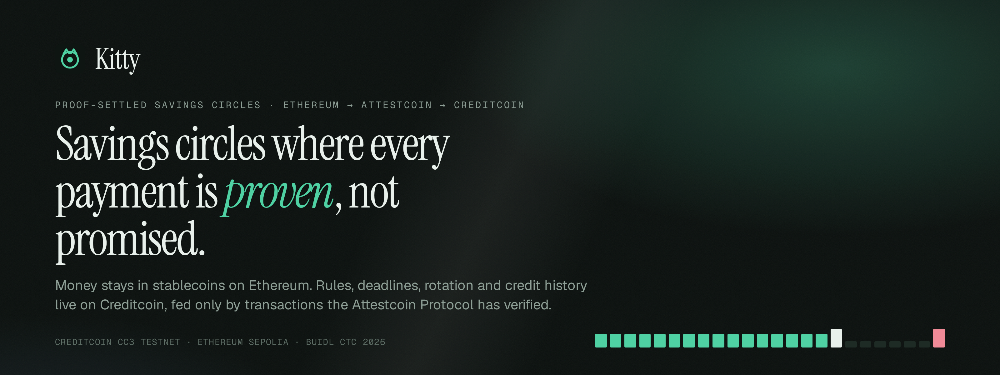
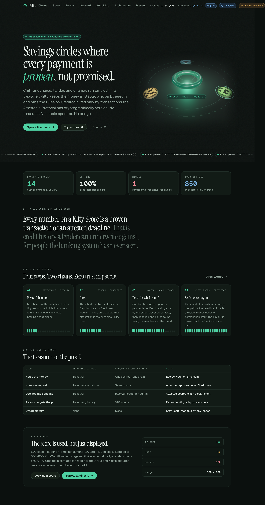
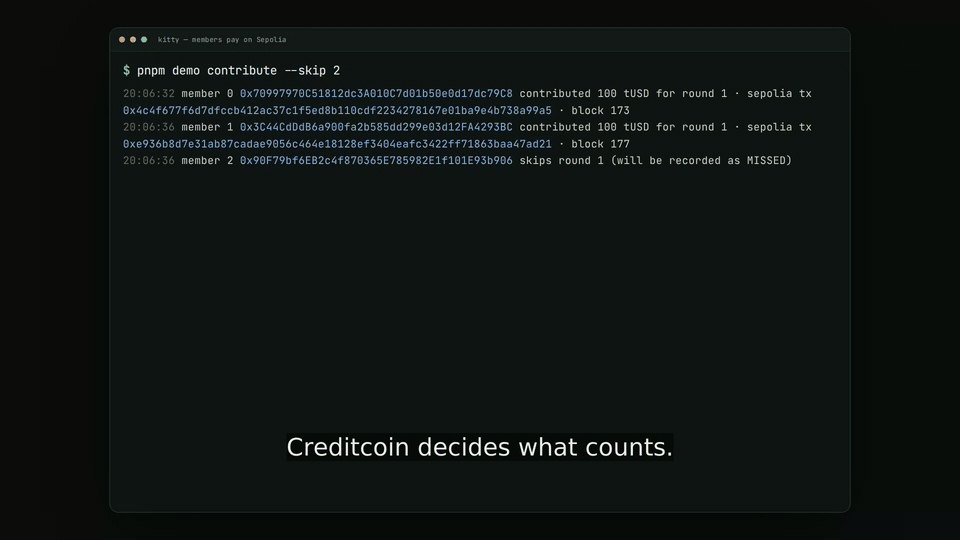
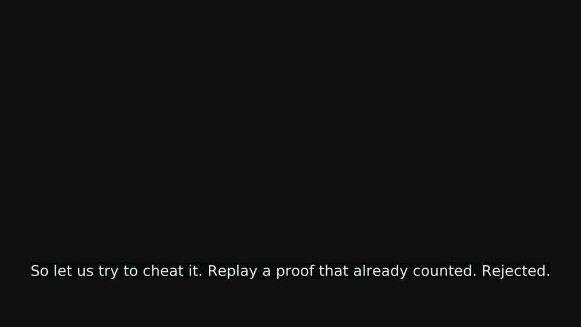
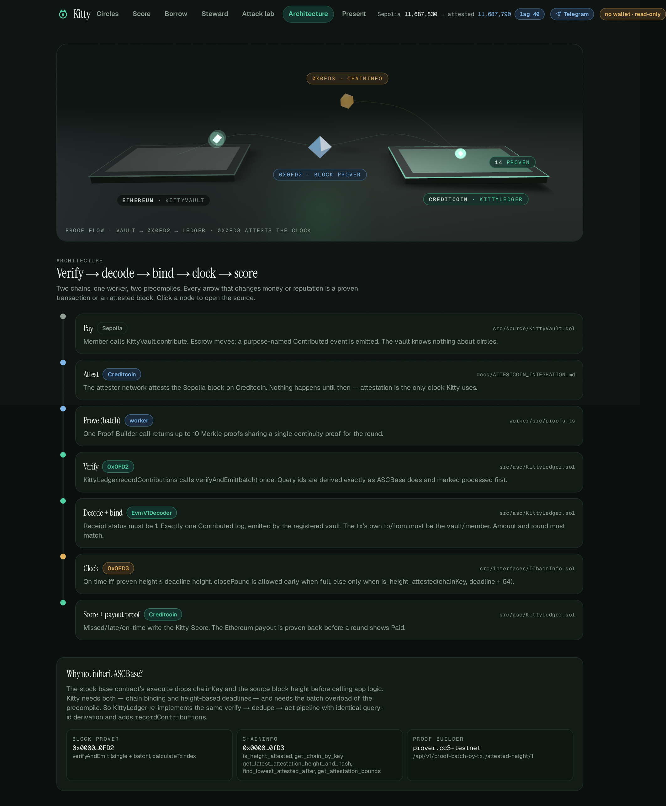
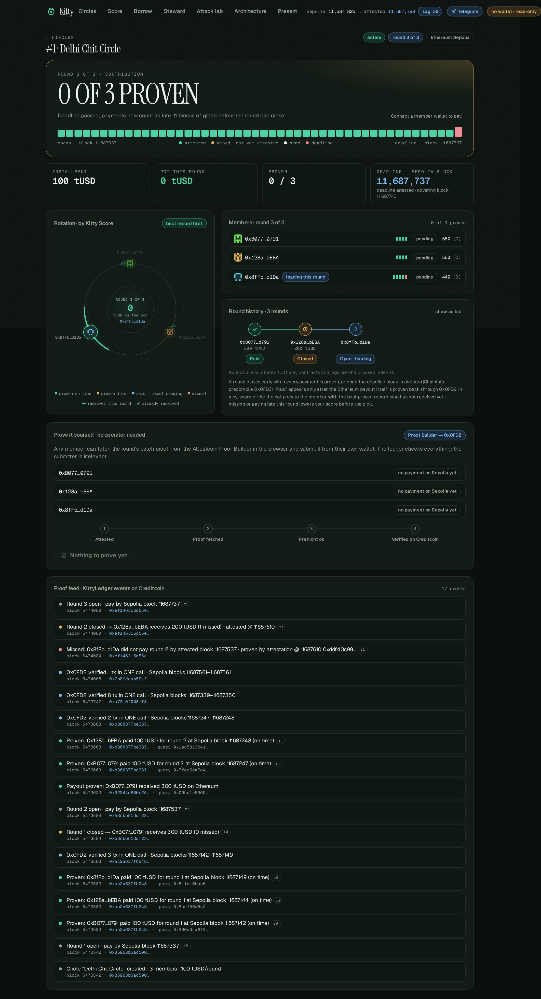
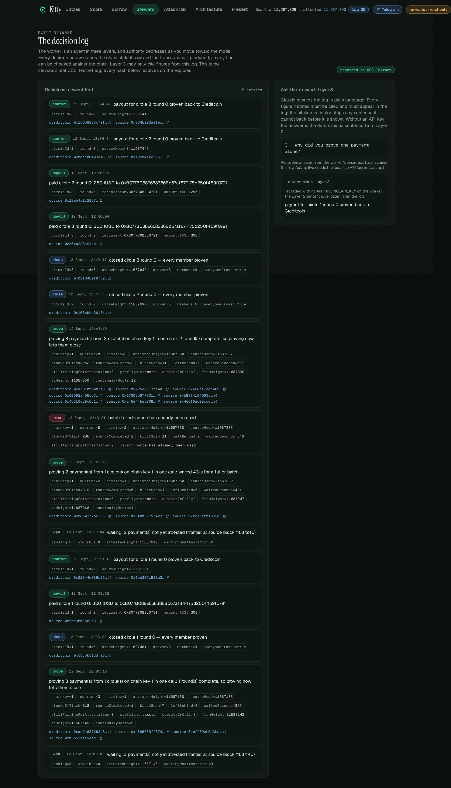
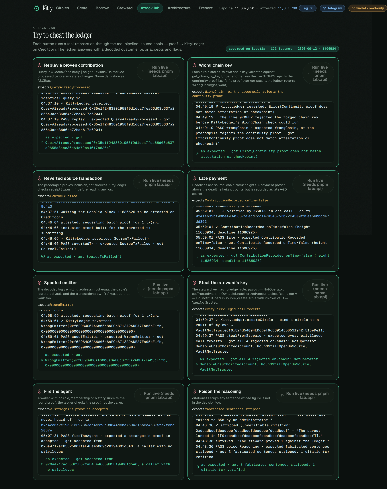
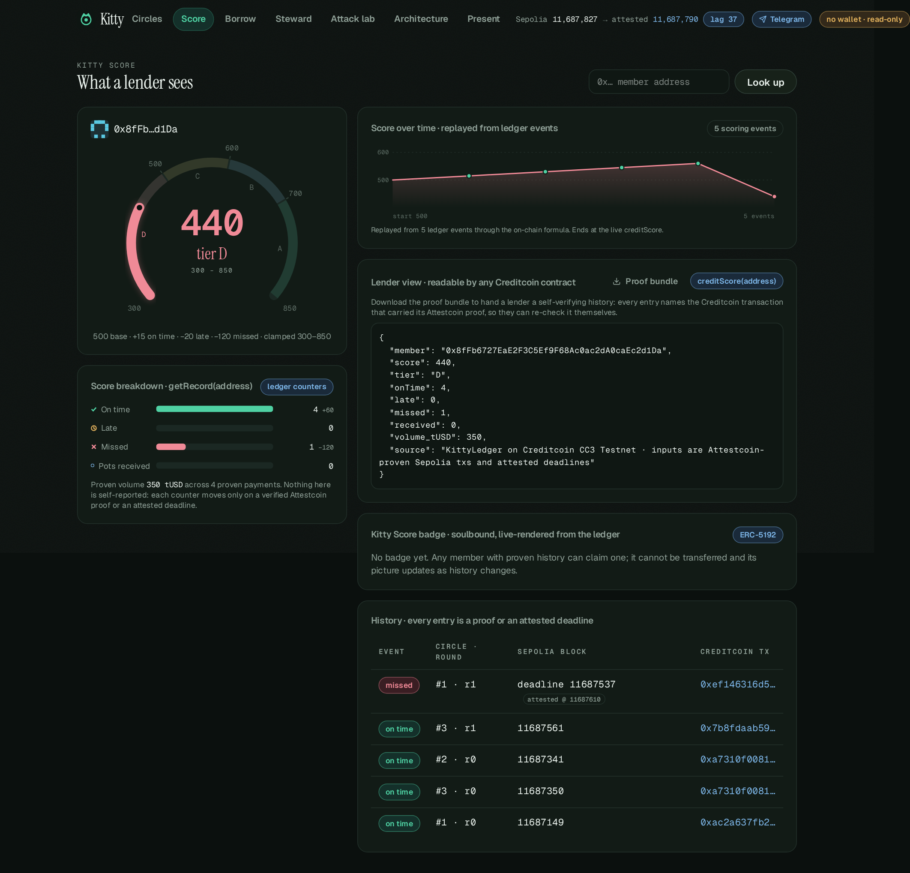

<p align="center">
  
</p>

<p align="center">
  <a href="https://github.com/Prashant-thakur77/Kitty/actions/workflows/ci.yml"></a>
  
  
  
  
  
  <a href="LICENSE"></a>
</p>

<p align="center">
  <b>Kitty</b> is a rotating savings circle — a chit fund, a susu, a tanda — where the money stays in stablecoins on Ethereum and the rules live on Creditcoin, fed only by transactions the <b>Attestcoin Protocol</b> has cryptographically verified. No treasurer. No oracle operator. No bridge. The output is a credit history a lender can underwrite against, for people the banking system has never seen.
</p>

**What no other Attestcoin contract in this field does**

- **Settles up to ten payments from every open circle in one precompile call.** Payments from every open circle are pooled into one `verifyAndEmit` under a single continuity proof, preflighted for free with the view `verify`, and measured 24% cheaper than singles against the live 0x0FD2 ([measured](#gas-measured)).
- **Has no clock but the attestor network.** Deadlines are Sepolia block heights; a round with a missing payment can close only when `is_height_attested(chainKey, deadline + 64)` says so, and the Ethereum payout is proven back before the round shows *Paid*.
- **Does not care who submits.** Fire the steward and a stranger's proof still settles the round; the steward's only on-ledger power is a proof.

<p align="center">
  <a href="#quick-start">Quick start</a> ·
  <a href="#how-a-round-settles">How it works</a> ·
  <a href="#attestcoin-integration">Attestcoin integration</a> ·
  <a href="#kitty-steward">The steward</a> ·
  <a href="#telegram">Telegram</a> ·
  <a href="#attack-lab">Attack lab</a> ·
  <a href="#security-model">Security model</a> ·
  <a href="docs/">Documentation</a>
</p>

---

## Contents

- [Overview](#overview)
- [Demo](#demo)
- [How a round settles](#how-a-round-settles)
- [Attestcoin integration](#attestcoin-integration)
  - [Files using Attestcoin](#files-using-attestcoin)
  - [Verified against the live precompile](#verified-against-the-live-precompile)
  - [Gas, measured](#gas-measured)
- [Kitty Steward](#kitty-steward)
- [Telegram](#telegram)
- [Attack lab](#attack-lab)
- [Kitty Score and credit](#kitty-score-and-credit)
- [Quick start](#quick-start)
- [Deployments](#deployments)
- [Repository layout](#repository-layout)
- [Documentation](#documentation)
- [Security model](#security-model)
- [Design notes](#design-notes)
- [Roadmap](#roadmap)
- [License](#license)

## Overview

Hundreds of millions of people save through rotating circles. Ten friends each pay the same amount every month, and one of them takes the pot. The system works because the members watch each other, and it fails in two ways: the treasurer disappears with the pot, or a member stops paying and nobody outside the group ever learns. Ten years of perfect payments build no formal credit history.

Kitty splits the circle along its natural seam.

| | Where | What lives there |
|---|---|---|
| **Money** | Ethereum Sepolia | `KittyVault`, a deliberately minimal escrow. It holds stablecoins and emits two purpose-named events. It does not know what a circle is. |
| **Proof** | Attestcoin Protocol | The attestor network attests Sepolia blocks on Creditcoin. The Proof Builder returns Merkle and continuity proofs. Two precompiles verify them natively. |
| **Rules** | Creditcoin CC3 Testnet | `KittyLedger`, an Attestcoin Smart Contract. Membership, deadlines, rotation, missed payments and the Kitty Score. It acts on nothing but proven transactions and attested blocks. |

Everything a member does is a plain deposit on the chain where they already hold money. Everything that decides who paid, who is late, who receives the pot and what a lender may trust happens on Creditcoin, and every one of those decisions traces back to a proof.

<p align="center">
  
</p>

## Demo

A five-minute narrated walkthrough (4:54): **[download the mp4](https://github.com/Prashant-thakur77/Kitty/releases/download/v2-submission/kitty-demo.mp4)** from the [v2-submission release](https://github.com/Prashant-thakur77/Kitty/releases/tag/v2-submission). The first three chapters are a 3D explainer rendered from the app's own `/story` route; everything after is the production dashboard against the live testnets, with a real circle member's wallet paying on Sepolia and proving the payment on Creditcoin from the browser during the take (both transactions are in the log below).

Chapters: 0:00 Hook · 0:10 The problem (3D) · 0:45 The split, money on Ethereum and rules on Creditcoin (3D) · 1:19 What Creditcoin makes possible (3D) · 1:39 Live on testnet, wallet connected · 1:54 A circle: attested-block deadline, rotation, history · 2:10 Paying from the browser, a real Sepolia transaction · 2:25 Proving it yourself: 0x0FD3 bounds, Proof Builder, free preflight, 0x0FD2, a real Creditcoin transaction · 2:51 The steward: eight payments from two circles in one call · 3:12 Attack lab recorded against the live precompile · 3:43 What a lender sees · 4:00 The Telegram bot · 4:17 Attestcoin depth · 4:40 Close.

<p align="center">
  
  
</p>

| Surface | Link |
|---|---|
| Demo video | https://github.com/Prashant-thakur77/Kitty/releases/download/v2-submission/kitty-demo.mp4 |
| Live dashboard | https://prashant-thakur77.github.io/Kitty/ (GitHub Pages, from `main`) |
| Deck | [`docs/Kitty-deck.pdf`](docs/Kitty-deck.pdf), also on the [release](https://github.com/Prashant-thakur77/Kitty/releases/tag/v2-submission); `/presentation` on the dashboard is the live version |
| Attack lab | `/lab`, eight live scenarios |
| Steward | `/steward`, the steward's decision log and citation validator, live |
| Source | https://github.com/Prashant-thakur77/Kitty |

## How a round settles

<p align="center">
  
</p>

1. **Create.** A group opens a circle on Creditcoin with its members (or signed invites), the installment, and a round length measured in *Sepolia blocks*. Circles can rotate in fixed order or by proven score.
2. **Pay.** Each round, members pay the installment into the vault on Sepolia. That is the whole of their interaction.
3. **Attest.** The attestor network attests the Sepolia block on Creditcoin. Nothing moves until it does; attestation is the only clock Kitty uses.
4. **Prove.** The steward pools pending payments from every open circle, fetches **one batch proof** for up to ten of them under a single continuity proof, asks the block-prover precompile's free view `verify` whether it holds, and only then submits `recordContributions`.
5. **Verify and bind.** The ledger verifies all payments in one precompile call, decodes each receipt with `EvmV1Decoder`, requires receipt status 1, requires the log to come from a vault trusted on that chain, requires the transaction's own `to` and `from` to be the vault and the member, and checks amount, round and replay.
6. **Close.** A round closes early when everyone has paid, or once the deadline block plus a 64-block grace window is attested. Members who consented to the circle and did not pay are recorded as missed. The recipient is deterministic: fixed order, or the best proven record that has not received yet.
7. **Pay out and prove back.** The vault pays the recipient on Sepolia. That `PaidOut` transaction is proven back to Creditcoin before the round can show *Paid*.
8. **Score.** Every member accrues a Kitty Score built solely from proven payments and attested deadlines. `KittyCreditLine` lends against it; `KittyBadge` renders it on chain.

<p align="center">
  
</p>

## Attestcoin integration

Kitty was built to use the protocol deeply rather than minimally. The full technical write-up required by the hackathon is in [`docs/ATTESTCOIN_INTEGRATION.md`](docs/ATTESTCOIN_INTEGRATION.md).

| Capability | Where | Why it matters |
|---|---|---|
| **Batch verification across circles** | `recordContributions` → `verifyAndEmit(chainKey, heights[], txs[], merkleProofs[], continuity)` | Up to ten queries under one continuity proof, pooled from every open circle. The continuity proof is checked once. |
| **Free preflight** | precompile view `verify`, both overloads, from the worker and from the browser | A proof that would fail is never submitted; a bad batch costs nothing. |
| **Attested-height clock** | `is_height_attested(chainKey, deadline + grace)` in `closeRound`; `onTime = height ≤ deadline` | No timestamps, no admin. The attestor network decides when a round ends. |
| **Attestation bounds** | `is_height_attested` as the clock; `find_lowest_attested_after` in `closeRound` to record *which* attestation proved every missed deadline (stored on the round, carried by `ContributionMissed` and `RoundClosed`) and from the dashboard (which attestation covers a payment); `get_chain_by_key` and `get_latest_attestation_height_and_hash` at circle creation (registry check; round 0's deadline must lie beyond the attested frontier, so an invite circle cannot be opened on an already-closed round) and the latter for the lag indicator; `get_attestation_bounds` for whether a deadline is covered | 6 of the ChainInfo precompile's 11 functions on the hot path, 4 of them inside the ledger; the 8-function interface in `IChainInfo.sol` is exercised against the mock in [`test/KittyMultiChain.t.sol`](test/KittyMultiChain.t.sol). |
| **Per-circle chain key** | validated at creation against the on-chain registry; the trusted-vault allowlist is keyed by chain | A circle settles from Sepolia (key 1) or Ethereum mainnet (key 3). A vault trusted on one chain is not trusted on another. |
| **Query-id replay protection** | `keccak(chainKey ‖ height ‖ txIndex)`, byte-identical to `ASCBase`, shared by every entry point, plus in-batch duplicate detection | The same proof can never count twice. |
| **Receipt status** | `receiptStatus == 1` before any log is read | The precompile proves inclusion, not success. |
| **Emitter and transaction binding** | `log.address_ == vault`, `tx.to == vault`, `tx.from == member` | A proof of someone else's transaction that merely contains a vault log is rejected. |
| **Proof-back of payouts** | `confirmPayout` and batch `confirmPayouts` on the `PaidOut` transaction | *Paid* is never an operator's claim. |
| **Browser-side proving** | Proof Builder is CORS-open; `ProvePanel` fetches the batch proof and submits from the member's wallet | The ledger checks the proof, never the caller. The steward is a convenience, not a dependency. |

### Files using Attestcoin

Every file that touches the protocol: precompiles `0x0FD2` and `0x0FD3`, `@gluwa/asc-contracts`, `@gluwa/usc-sdk`, or the Proof Builder.

| File | Usage |
|---|---|
| [`src/asc/KittyLedger.sol`](src/asc/KittyLedger.sol) | `INativeQueryVerifier.verifyAndEmit`, batch and single; `calculateTxIndex` for query ids; `EvmV1Decoder` for receipts and calldata; `IChainInfo.is_height_attested` and `get_chain_by_key` |
| [`src/interfaces/IChainInfo.sol`](src/interfaces/IChainInfo.sol) | Solidity interface for the ChainInfo precompile: eight functions with the exact struct layouts |
| [`src/asc/KittyViewer.sol`](src/asc/KittyViewer.sol) | One-call reads of proof-derived state |
| [`src/asc/KittyCreditLine.sol`](src/asc/KittyCreditLine.sol), [`src/asc/KittyBadge.sol`](src/asc/KittyBadge.sol) | Consumers of proof-derived state: a lender and a live-rendered soulbound badge |
| [`src/source/KittyVault.sol`](src/source/KittyVault.sol) | Source-chain contract in the readability pattern: minimal logic, purpose-named events |
| [`worker/src/proofs.ts`](worker/src/proofs.ts) | `ProofBuilder.waitUntilHeightAttested`, `getBatchProof`, fallback to `getProof` + `mergeProofs`; local mode uses the SDK's `encoding.abiEncode` |
| [`worker/src/verifier.ts`](worker/src/verifier.ts), [`web/src/lib/verifier.ts`](web/src/lib/verifier.ts) | The view `verify` overloads as a free preflight, and the per-payment re-verify receipt |
| [`worker/src/agent/policy.ts`](worker/src/agent/policy.ts) | Batch policy: cross-circle pooling, one chain key per call, urgency over thrift |
| [`worker/src/verify-live.ts`](worker/src/verify-live.ts) | Real proof against the live precompile, with tamper and wrong-chain negatives |
| [`web/src/lib/prover.ts`](web/src/lib/prover.ts), [`web/src/components/ProvePanel.tsx`](web/src/components/ProvePanel.tsx) | Browser-side proving against the Proof Builder |
| [`web/src/hooks.ts`](web/src/hooks.ts) | `find_lowest_attested_after`, `get_attestation_bounds`, `get_latest_attestation_height_and_hash` via wagmi |
| [`test/`](test), [`test/fixtures/`](test/fixtures) | Precompiles mocked at their real addresses with `vm.etch`; genuine Proof Builder bytes as a fixture |
| [`scripts/local-e2e.sh`](scripts/local-e2e.sh), [`scripts/scenarios.sh`](scripts/scenarios.sh) | Two anvils, precompiles mocked with `anvil_setCode`, the full loop and every attack scenario |

### Verified against the live precompile

Before the Creditcoin-side deployment, the proof path was exercised against the real network. A Proof Builder proof for a real Sepolia transaction was submitted to the live block prover at `0x0FD2` on CC3 Testnet:

```
0x0FD2.calculateTxIndex = 44
0x0FD2.verify(chainKey 1, height 11656295) = true
0x0FD2.verify(tampered txBytes)  = reverted: "Merkle proof validation failed"
0x0FD2.verify(wrong chainKey 3)  = reverted: "Continuity proof does not match attestation or checkpoint"
```

And the batch overload, with three real transactions from two Sepolia blocks under one shared continuity proof:

```
batch proof: 3 tx over blocks 11656253–11656295 · ONE continuity proof (48 roots)
0x0FD2.verify(BATCH of 3, one shared continuity proof) = true
```

Reproduce on any Sepolia transaction with `pnpm verify:live <txhash> [<txhash> …]`.

### Gas, measured

`eth_estimateGas` against the live precompile with real proofs:

| Call | Continuity roots | Gas |
|---|---|---|
| single `verify`, tx at 11656253 #86 | 48 | 104,141 |
| single `verify`, tx at 11656253 #85 | 48 | 112,239 |
| single `verify`, tx at 11656295 #44 | 6 | 45,433 |
| three singles, total | | 261,813 |
| **one batch `verify` of the same three** | 48, shared | **199,375** |

The batch is 24% cheaper for three payments, and the saving grows with block age because the continuity proof is verified once instead of once per payment.

## Kitty Steward

The worker is an agent in three layers, and authority decreases as you move toward the model.

| Layer | Holds | What it does |
|---|---|---|
| **1 · The ledger** | final say | A verified proof, receipt status 1, a trusted emitter, the right sender and target, the exact amount, the current round, an unseen query id. Fail any one and nothing happens, whoever asked. |
| **2 · Deterministic decisions** | timing only | Prove now or wait for a fuller batch? Batching is measurably cheaper, but a payment that misses its grace window costs its owner 120 score points. Urgency beats thrift and thrift beats impatience. Every decision is logged with the chain state behind it. [`policy.ts`](worker/src/agent/policy.ts), 17 unit tests. |
| **3 · Cited reasoning** | none | Claude explains the decision log in plain language. Every figure it states must be marked and must appear in the log; [`citations.ts`](worker/src/agent/citations.ts) removes any sentence with an unverifiable *or uncited* figure before display. 12 unit tests. |

Two properties follow, and both are demonstrated in the attack lab rather than asserted.

- **The steward's Creditcoin key is worth nothing.** No role, no ownership, no allowance; everything it calls on the ledger is callable by anyone. On Sepolia this build runs the vault-operator key in the same process: that is the one privileged action in the system, it is bounded by `KittyVault` to addresses that have paid into the circle, and it is exactly the action Attestcoin writability removes.
- **The model is optional.** With no API key the steward prints the deterministic sentence from layer 2 and behaves identically.

The decision log and the citation validator are part of the product, not a debug file: `/steward` lists every decision with the chain state behind it and lets a reviewer question the agent.

<p align="center">
  
</p>

```bash
pnpm test:agent                       # policy + citation validator, no network
pnpm explain "why did you wait?"      # cited explanation, or the deterministic fallback
```

## Telegram

A circle lives in a group chat, so Kitty does too. [`bot/`](bot/) is a Telegram bot ([@KittyCirclesBot](https://t.me/KittyCirclesBot)) that pushes every proof into the chat and opens the dashboard as a Mini App; [`docs/TELEGRAM.md`](docs/TELEGRAM.md) has the BotFather setup.

- `/circle 1` — the live circle: round, deadline block against the attested frontier from `0x0FD3`, who is proven, pending or missed, pot, next recipient, explorer links.
- `/score 0x…` — Kitty Score, tier, counters and the credit limit from `KittyCreditLine.underwrite`.
- `/watch 0x…`, `/watch circle 1` — one message per `ContributionRecorded`, `ContributionMissed`, `BatchVerified`, `RoundClosed`, `RoundOpened`, `PayoutConfirmed`, each with its Creditcoin transaction and query id, in the dashboard feed's own words; plus one reminder per round when a watched member has not paid and the attested frontier is within 40 blocks of the deadline.
- `/steward` — the last five decisions from the steward's log.

The bot holds no key and trusts nothing it is told: every answer is a view call, every push is a ledger event. Without `BOT_TOKEN` it runs dry, watching the ledger and printing what it would send, so it can be demonstrated offline:

```bash
pnpm test:bot                                                   # message formatting, no network
KITTY_ENV_FILE=worker/.env.world BOT_WATCH="circle 1" pnpm bot:dry --once
BOT_SIMULATE="/circle 1; /score 0xB077B088E668386Bc57af87F175d250f459f0791" pnpm bot:dry   # live testnet, read-only
```

## Attack lab

Eight scenarios, each of which pushes a real transaction through proof, precompile and ledger. `pnpm scenarios` brings up two anvils, runs all of them and exits with the tally. They also run in CI on every push.

| Scenario | Answer |
|---|---|
| Replay an already-counted proof | `QueryAlreadyProcessed(queryId)` |
| Fake vault emits a byte-identical `Contributed` event | `WrongEmitter(got, want)` |
| Same proof, chain key 3 | rejected by the live 0x0FD2 itself ("Continuity proof does not match attestation"); against a permissive verifier the ledger reverts `WrongChain(3, 1)` |
| Included but reverted source transaction | `SourceTxFailed()` |
| Payment after the deadline block | Accepted, `onTime = false`, score −20 |
| Steal the steward's on-ledger powers: a fresh key tries to take a pot, trust a vault, close a round early, bind a circle to its own vault | `NotOperator()`, `OwnableUnauthorizedAccount(…)`, `RoundStillOpenOnSource(…)`, `VaultNotTrusted(…)` |
| Fire the agent: a wallet with no role, membership or history submits the round's proof | Accepted. The ledger checks the proof, not the caller |
| Poison the reasoning: one cited fact and three invented figures | All three stripped before display |

<p align="center">
  
</p>

The last scenario found a genuine bug during development: stripping non-digits from a fabricated address left `0`, which the decision log contains, so the invented address passed the citation check. Hex is now matched only as a hash prefix, with regression tests.

## Kitty Score and credit

`creditScore(member)` = 500 + 15·onTime − 20·late − 120·missed, clamped to 300–850, with tiers A ≥ 700, B ≥ 600, C ≥ 500, D below. Every input is a proven transaction or an attested deadline, and nobody can be penalised for a circle they did not consent to.

The score is used, not just displayed. `KittyCreditLine` underwrites purely from it: tier A may borrow 100% of proven contribution volume, B 50%, C 20%, D nothing. `KittyBadge` is an ERC-5192 soulbound token whose on-chain SVG renders the current score live. A member can also export a bundle of proof receipts that any lender can re-verify against the precompile without trusting Kitty (`pnpm receipts <address> receipts.json`; every row carries the source tx, proven height, query id and Creditcoin tx, re-checkable with `pnpm verify:live <sourceTx>`).

<p align="center">
  
</p>

*Above: a real member of the live circles after missing round 1 of the Delhi Chit Circle on 12 September 2026. The miss carries the attestation that proved the deadline (`attested @ 11687610`), the score fell from 560 to 440, and every row links to the Creditcoin transaction.*

## Quick start

Requirements: Foundry, Node 22 with pnpm, and Docker is not needed. The first four commands run offline against two local anvils with the precompiles mocked at their real addresses; `pnpm judge` runs them all and then reaches the live CC3 Testnet precompile (internet, no .env needed).

```bash
git clone https://github.com/Prashant-thakur77/Kitty && cd Kitty
pnpm install && pnpm --dir web install

forge test              # 162 tests: ledger, vault, invites, rotation, viewer, credit line, badge, multi-chain, batch payouts, real prover bytes
pnpm test:agent         # 29 tests: batch policy and citation validator
pnpm scenarios          # 8 attack scenarios end to end
pnpm e2e:local          # two full rounds, a missed payment, a payout proven back, a replay rejected
pnpm judge              # forge + agent tests + scenarios + e2e, then a real proof checked by the live 0x0FD2 (~5 min)
```

To explore the dashboard against a populated local world:

```bash
WORLD_ROUND1=0 scripts/local-world.sh     # two anvils, contracts, one proven round; stays up
pnpm --dir web dev                        # http://localhost:5173
KITTY_ENV_FILE=worker/.env.world pnpm lab:api   # powers /lab against the world above (run one local world at a time)
```

Testnet:

```bash
cp .env.example .env                      # PRIVATE_KEY needs Sepolia ETH and tCTC
scripts/deploy.sh                         # resumable; writes .env, web/.env.production, deployments.json
pnpm demo fund && pnpm demo create && pnpm demo contribute
pnpm worker                               # attestation wait → batch proof → record → close → payout → proof-back
```

Faucets: Sepolia ETH from [Alchemy](https://www.alchemy.com/faucets/ethereum-sepolia); tCTC from the Creditcoin Discord `#token-faucet` (`/faucet address:0x…`).

## Deployments

| Contract | Network | Address |
|---|---|---|
| KittyVault | Ethereum Sepolia, chainKey 1 | [`0xa27eD42Ce06AaBe1D5924272fDb913b4CBC0DA84`](https://sepolia.etherscan.io/address/0xa27eD42Ce06AaBe1D5924272fDb913b4CBC0DA84) |
| TestUSD | Ethereum Sepolia | [`0xc6fe7fd411681E07a44523f87F6aB0805903c2dE`](https://sepolia.etherscan.io/address/0xc6fe7fd411681E07a44523f87F6aB0805903c2dE) |
| FakeVault (attack lab) | Ethereum Sepolia | [`0xf6f984c6aa6806a8afcc8713a2adea7fa05cf1fb`](https://sepolia.etherscan.io/address/0xf6f984c6aa6806a8afcc8713a2adea7fa05cf1fb) |
| KittyLedger (Attestcoin Smart Contract) | Creditcoin CC3 Testnet, 102031 | [`0xC2A1583F9a469EE98f2A1acF6297a0d6A073F276`](https://creditcoin-testnet.blockscout.com/address/0xC2A1583F9a469EE98f2A1acF6297a0d6A073F276) |
| KittyViewer | Creditcoin CC3 Testnet, 102031 | [`0xFfA85A21eBa3e46EFe3C53c77f1AF4f4Cdddc947`](https://creditcoin-testnet.blockscout.com/address/0xFfA85A21eBa3e46EFe3C53c77f1AF4f4Cdddc947) |
| KittyUSD | Creditcoin CC3 Testnet, 102031 | [`0x1172ABd45724069749E9EB98A0349177435B284E`](https://creditcoin-testnet.blockscout.com/address/0x1172ABd45724069749E9EB98A0349177435B284E) |
| KittyCreditLine | Creditcoin CC3 Testnet, 102031 | [`0xB54943A1cEd46aE1bB844260B77896b9A134B1ED`](https://creditcoin-testnet.blockscout.com/address/0xB54943A1cEd46aE1bB844260B77896b9A134B1ED) |
| KittyBadge (ERC-5192) | Creditcoin CC3 Testnet, 102031 | [`0x17EcDc95Be4f238e26F8f2005ED60D2bd22C1F46`](https://creditcoin-testnet.blockscout.com/address/0x17EcDc95Be4f238e26F8f2005ED60D2bd22C1F46) |
| Block prover precompile | Creditcoin | `0x0000000000000000000000000000000000000FD2` |
| ChainInfo precompile | Creditcoin | `0x0000000000000000000000000000000000000fD3` |
| Deployer / operator | both | [`0xD793169c516c9F9A334218608fbF6E1338b3DE56`](https://creditcoin-testnet.blockscout.com/address/0xD793169c516c9F9A334218608fbF6E1338b3DE56) |

Deployed from block 5473533 (12 September 2026), paired with a fresh vault: a vault marks payouts per circle and round, so it serves exactly one ledger (`scripts/deploy.sh` enforces the pairing). The first ledger, `0xc6fe…c2dE` from block 5473022 with vault `0x1172…284E`, ran the first circle and all eight attack scenarios; this build additionally bounds `startHeight` by the attested frontier, refuses payments that predate the circle, and records the attestation behind every missed deadline. The first live circle, *Delhi Chit Circle*, settled round 0 end to end on the same day: three Sepolia payments, two batch proofs verified by the block-prover precompile, an early close, a 300 tUSD payout on Sepolia and its proof back to Creditcoin. On the first ledger, round 0 landed in two calls (1 + 2) because the steward's batch timer fired before two payments were attested; with the roundmate hold rule, the final ledger's round 0 was verified as one batch of three in a single precompile call (`0xac2a…2fe9`), closed, paid out and proven back. Every testnet transaction is logged with an explorer link in [`docs/TESTNET_LOG.md`](docs/TESTNET_LOG.md).

## Repository layout

```
src/
  source/KittyVault.sol       Sepolia escrow; Contributed / PaidOut; pays only contributors of the circle
  source/TestUSD.sol          6-decimal demo stablecoin
  source/FakeVault.sol        attack-lab spoof emitter
  asc/KittyLedger.sol         the ASC: batch verify, decode, bind, per-circle chain key, grace, consent, rotation, invites, score
  asc/KittyViewer.sol         one-call reads
  asc/KittyCreditLine.sol     lender underwriting from the score; KittyUSD.sol is its demo asset
  asc/KittyBadge.sol          ERC-5192 badge with a live on-chain SVG
  interfaces/IChainInfo.sol   ChainInfo precompile interface
test/                         Foundry tests, precompile mocks, prover-format fixtures, real prover bytes
worker/
  src/worker.ts               the steward loop
  src/agent/                  policy (layer 2), decision log, citations and explainer (layer 3)
  src/proofs.ts, verifier.ts  Proof Builder client, precompile preflight
  src/scenarios.ts, api.ts    attack scenarios and the SSE lab API
  src/verify-live.ts          real proofs against the live precompile
web/                          Vite + React + wagmi dashboard
scripts/                      deploy.sh · local-setup.sh · local-world.sh · local-e2e.sh · scenarios.sh · media/
docs/                         integration write-up, plans, submission material, testnet log, deck (the demo video is a release asset)
```

## Documentation

Index with one line per file: [`docs/README.md`](docs/README.md).

| Document | Description |
|---|---|
| [`docs/TECH.md`](docs/TECH.md) | Technical note: the core insight, the nineteen checks from a Sepolia payment to Creditcoin state, the attestation clock, rotation, the score, the steward's three layers, batch policy, measured gas, Attestcoin coverage, limits |
| [`docs/specs/PROTOCOL.md`](docs/specs/PROTOCOL.md) | Protocol specification: data model, state machines, the complete `KittyLedger` and `KittyVault` interfaces, event and error catalogues, query-id derivation, numbered invariants |
| [`docs/THREAT_MODEL.md`](docs/THREAT_MODEL.md) | Assets, actors, trust assumptions, threat table with the exact mitigating check and its test, the eight attack scenarios, known limits |
| [`docs/AUDIT_CHECKLIST.md`](docs/AUDIT_CHECKLIST.md) | Reviewer checklist by contract and worker component, each item pointing at the code and the covering test, with a findings log |
| [`docs/ATTESTCOIN_INTEGRATION.md`](docs/ATTESTCOIN_INTEGRATION.md) | The hackathon's required integration write-up: pipeline, precompile functions used, files, gas |
| [`docs/GAS.md`](docs/GAS.md) | Contract gas per operation, measured in Foundry, separate from the live precompile figures |
| [`docs/adr/0001-attestation-as-the-only-clock.md`](docs/adr/0001-attestation-as-the-only-clock.md) | ADR: block-height deadlines, `is_height_attested` as the only clock, the 64-block grace constant |
| [`docs/adr/0002-money-and-rules-on-different-chains.md`](docs/adr/0002-money-and-rules-on-different-chains.md) | ADR: a dumb vault on Sepolia, a proof-only ledger on Creditcoin, the bounded operator, writability |
| [`docs/adr/0003-batch-proofs-and-the-roundmate-hold.md`](docs/adr/0003-batch-proofs-and-the-roundmate-hold.md) | ADR: one continuity proof for up to ten payments, the batch policy, the hold rule |
| [`docs/adr/0004-consent-grace-and-fallback-recipient.md`](docs/adr/0004-consent-grace-and-fallback-recipient.md) | ADR: who can be marked missed, how a round with missing payments closes, where an unclaimed pot goes |
| [`docs/adr/0005-one-vault-per-ledger.md`](docs/adr/0005-one-vault-per-ledger.md) | ADR: why a ledger redeploy pairs with a fresh vault and why a payment cannot predate its circle |
| [`docs/OPERATIONS.md`](docs/OPERATIONS.md) | Runbook: env keys, `deploy.sh`, seeding, the worker and its state files, the lab API, recording, `txlog`, recovery procedures, local worlds, CI, Pages |
| [`docs/USER_SCENARIOS.md`](docs/USER_SCENARIOS.md) | Every dashboard flow for members, organisers, lenders and reviewers, with UI states and on-chain effects |
| [`docs/DEMO_RUNBOOK.md`](docs/DEMO_RUNBOOK.md) | The recording-day script for the testnet demo |
| [`docs/TELEGRAM.md`](docs/TELEGRAM.md) | The Telegram bot and Mini App |
| [`docs/TESTNET_LOG.md`](docs/TESTNET_LOG.md) | Every testnet transaction with explorer link and gas |
| [`docs/SUBMISSION.md`](docs/SUBMISSION.md) | The DoraHacks submission fields |
| [`docs/STRATEGY.md`](docs/STRATEGY.md), [`docs/MASTER_PLAN.md`](docs/MASTER_PLAN.md), [`docs/BUILD_PLAN.md`](docs/BUILD_PLAN.md), [`docs/AGENT_PLAN.md`](docs/AGENT_PLAN.md) | Strategy, sourcing, build order and the v2 agent plan |
| [`docs/Kitty-deck.pdf`](docs/Kitty-deck.pdf) | The deck, printed from `/presentation` |
| [`.env.example`](.env.example) | Environment variable template |

## Security model

Reviewed against an adversarial model in which the Attestcoin precompiles are trusted and everything else, including proof submitters, members, organisers, the vault operator and other contracts, is hostile. Findings from that review are fixed in code and covered by tests.

| Claim | Backed by |
|---|---|
| Member X paid round R | Proof verified by `0x0FD2`; receipt status 1; exactly one `Contributed` log from a vault trusted on that chain; tx `to` = vault, `from` = member; exact amount; current round |
| Payment was on time | Proven source block height ≤ deadline height |
| Member Y missed round R | Deadline plus a 64-block grace window attested; no proven payment; and Y consented to the circle by invite, organising, `acceptMembership`, or a prior payment |
| Recipient Z was paid | `PaidOut` proven by `0x0FD2` with matching recipient and amount; the vault pays only an address that has paid into that circle |
| Recipient Z deserved the pot | Z paid this round and had not received before; otherwise the pot rolls forward, and in the final round it goes to a paying member (`FallbackRecipient`) so escrow never strands |
| The same proof cannot count twice | Query id shared by every entry point, in-batch duplicate check, per-(circle, round, member) guard |
| A proof from another chain cannot count | Chain key per circle, validated against the registry; the vault allowlist is keyed by chain |
| An invite is genuine | Organiser's EIP-191 signature over (ledger, chainId, circleId, invitee, nonce); single-use nonces; OpenZeppelin ECDSA |
| Score cannot be minted | Only trusted vaults feed volume; credit limits derive from that volume; misses require consent |
| LP fees are not stranded | Withdrawals are pro-rata over pool value |

Known limits, stated plainly: the vault operator *sends* payouts, and the steward process holds the operator key today, which Attestcoin writability will replace once audited; a payout mis-routed inside the group is not recoverable; loan defaults do not yet feed back into the score; members paying through smart-account wallets are not credited, because the transaction's own `from` must be the member; a payment that lands after its round has closed is never recorded and its escrow is not refunded by this build (the vault needs a `refundUnrecorded` path gated by an Attestcoin proof of the ledger's `RoundClosed` event, which is writability territory); and the steward's batching timer is tuned to the ~40-block attestation lag, so a much slower attestor would make it fall back to smaller batches rather than miss a grace window.

## Design notes

- **Why not inherit `ASCBase`?** Its `execute` drops the chain key and the source block height before calling app logic. Kitty needs both, for chain binding and height-based deadlines, and needs the batch overload, so the ledger re-implements the same verify → dedupe → act pipeline with identical query-id derivation.
- **Why block heights instead of timestamps?** Attested height is the one clock every party can verify. A timestamp is an opinion; an attested block is a fact.
- **Why a 64-block grace window?** A payment mined at the deadline block is attested at the same moment its round becomes closable. Without a window, a rival could close the round before the proof lands. A proof that lands after a round has closed cannot be recorded; the steward proves as soon as a payment's block is attested, well inside the window.
- **Why can anyone submit a proof?** Because the ledger's checks are complete without knowing who is calling. That is what lets a member finish a round from the browser when the steward is switched off.
- **Why is the model advisory only?** The 2026 Convergence winners in CRE & AI and Autonomous Agents, and the 2025 Chromion DeFi winner, all made the agent propose and the contract dispose. Kitty goes further: the agent's only power is to submit proofs, and its explanations are filtered by a validator that removes any figure the decision log cannot back.
- **What was hard.** `forge script` cannot simulate Creditcoin blocks; deployment uses `forge create`. The SDK's gas fallback underestimates batch calls; the worker floors it. Hosted Sepolia RPCs cap log ranges; the worker scans in 50-block windows. Back-to-back sends on a fast chain race the node's nonce; the worker uses `NonceManager` and resets it after any failed send.

## Roadmap

Score-gated circle sizes · seat bidding for early payout · loan defaults feeding the score · Attestcoin writability for payouts once audited · Ethereum mainnet chain key on CC3 mainnet · pot cover through proven-event insurance.

## License

Released under the [MIT License](LICENSE). Built by Prashant for BUIDL CTC 2026 Fall, with the Attestcoin Protocol at its core.
