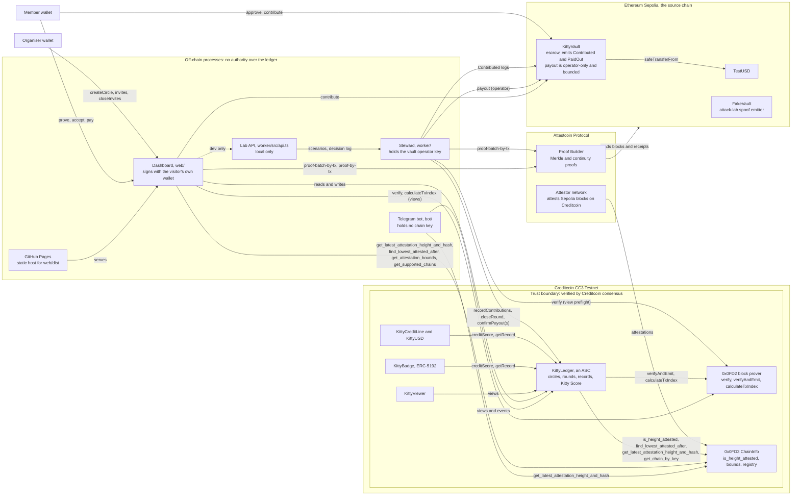
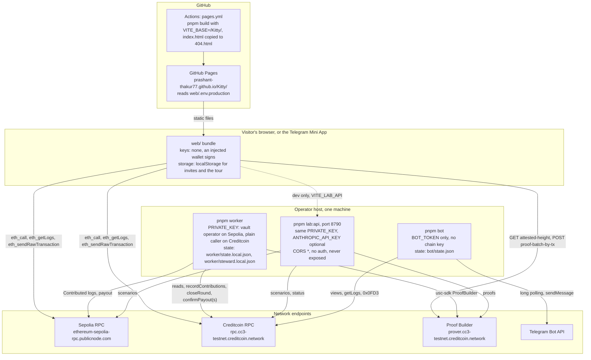
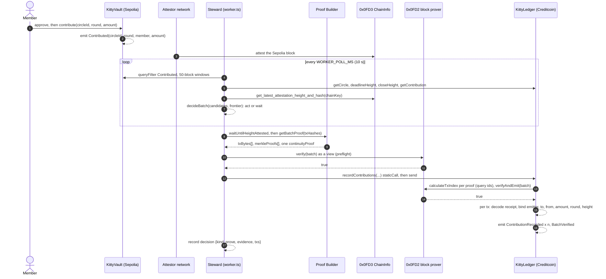
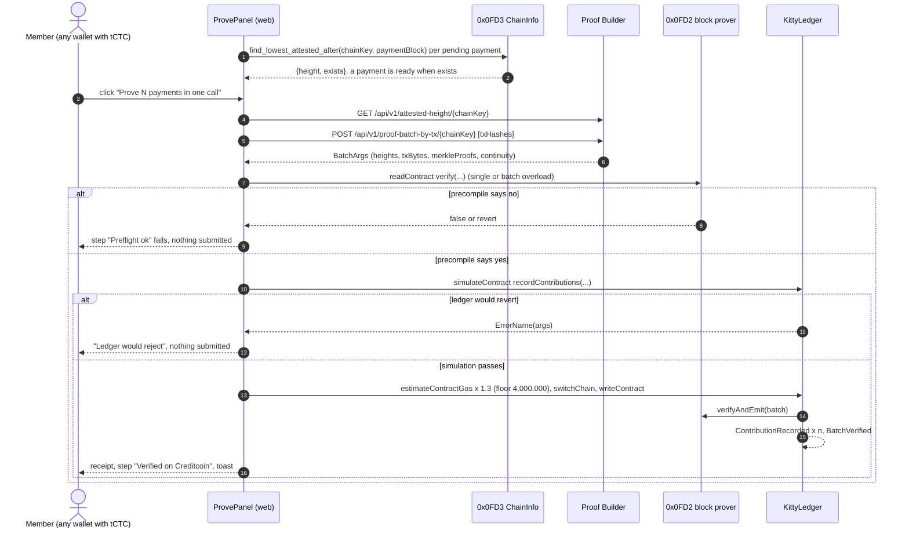
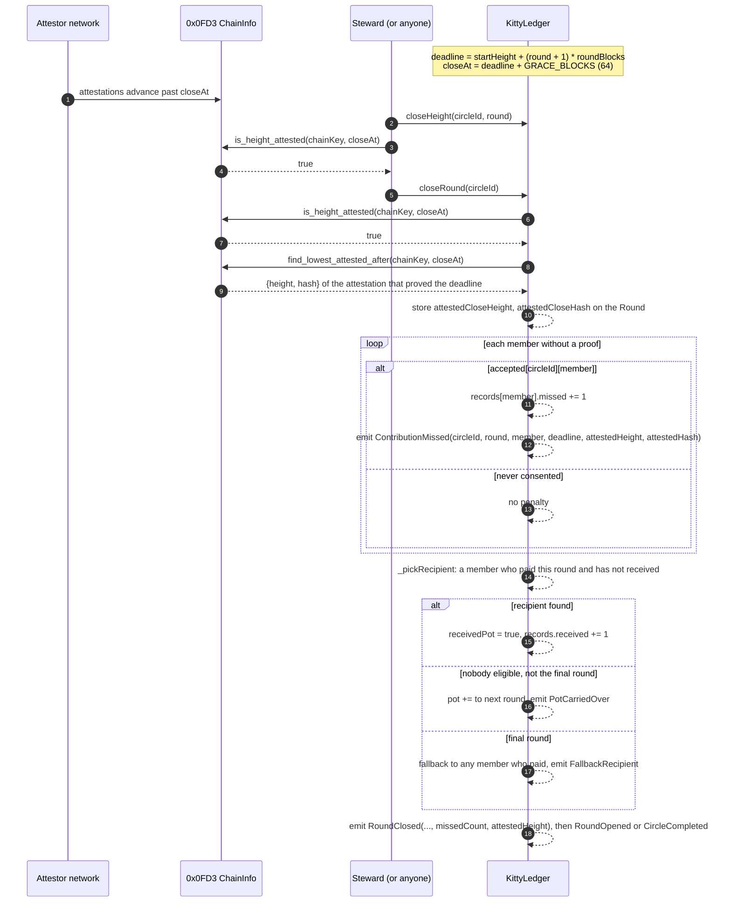
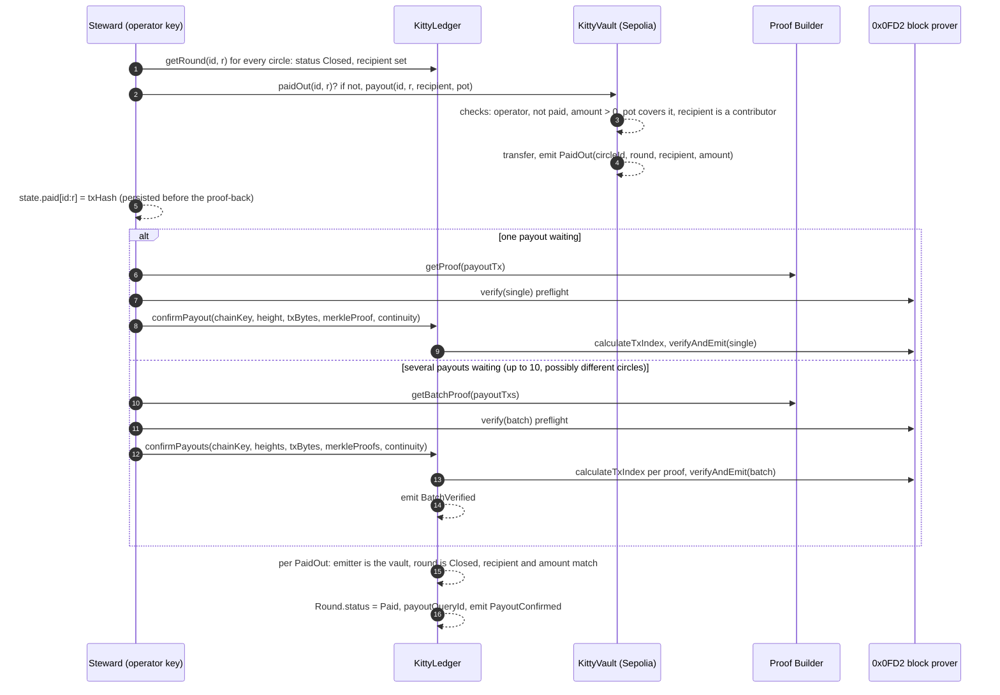
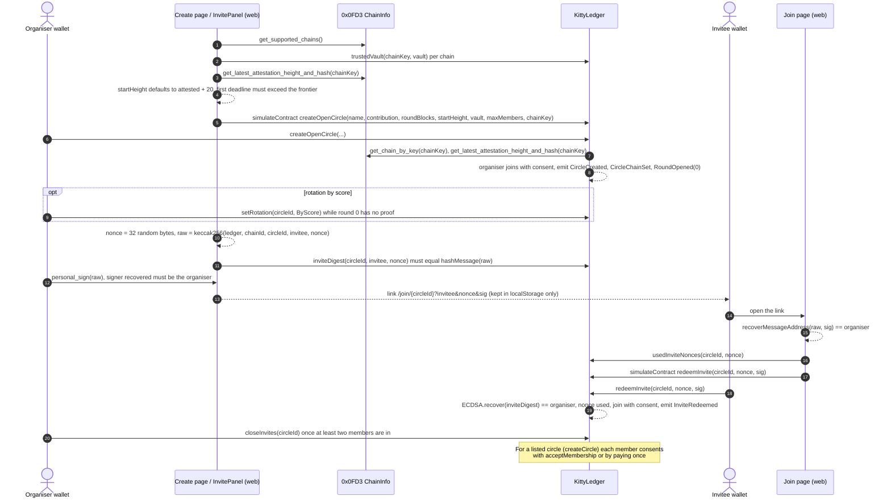
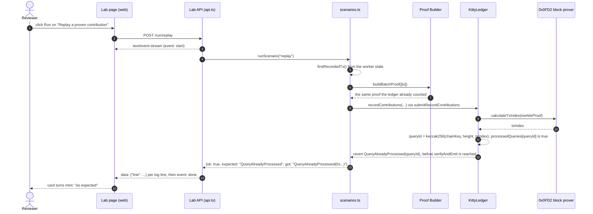
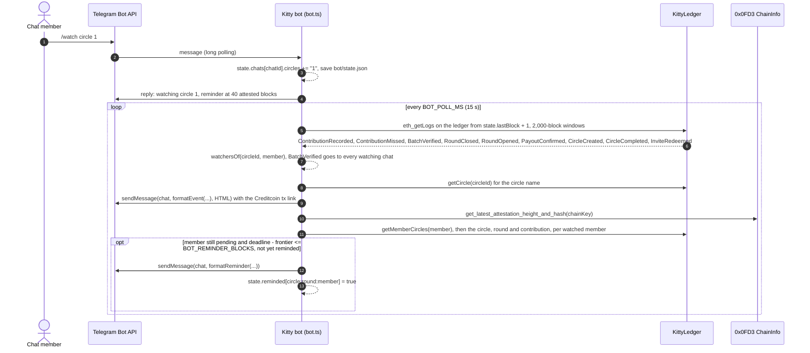

# Kitty Architecture

The top-level view of the system: which components exist, where each one runs and what it holds, and how the main flows move across the two chains. Every diagram is followed by a short walkthrough with links to the code that implements it. The deeper references are [`TECH.md`](TECH.md) (the checks), [`specs/PROTOCOL.md`](specs/PROTOCOL.md) (the interface), [`THREAT_MODEL.md`](THREAT_MODEL.md), [`ATTESTCOIN_INTEGRATION.md`](ATTESTCOIN_INTEGRATION.md), [`OPERATIONS.md`](OPERATIONS.md), and under [`reference/`](reference/): [`CONTRACTS.md`](reference/CONTRACTS.md), [`STORAGE_LAYOUT.md`](reference/STORAGE_LAYOUT.md), [`STEWARD.md`](reference/STEWARD.md), [`DATA_FORMATS.md`](reference/DATA_FORMATS.md), [`LAB_API.md`](reference/LAB_API.md), [`BOT.md`](reference/BOT.md) and [`WEB.md`](reference/WEB.md). Terms are defined in [`GLOSSARY.md`](GLOSSARY.md).

## Contents

- [Components and the trust boundary](#components-and-the-trust-boundary)
- [Deployment](#deployment)
- [Sequence: pay and prove, by the steward](#sequence-pay-and-prove-by-the-steward)
- [Sequence: prove from the browser, by a member](#sequence-prove-from-the-browser-by-a-member)
- [Sequence: a round closes on the attested deadline with a miss](#sequence-a-round-closes-on-the-attested-deadline-with-a-miss)
- [Sequence: payout and proof-back, single and batch](#sequence-payout-and-proof-back-single-and-batch)
- [Sequence: circle creation with invites and consent](#sequence-circle-creation-with-invites-and-consent)
- [Sequence: the attack lab replays a proof](#sequence-the-attack-lab-replays-a-proof)
- [Sequence: a Telegram push](#sequence-a-telegram-push)

## Components and the trust boundary

The trust boundary is Creditcoin consensus. Inside it, `KittyLedger` ([`src/asc/KittyLedger.sol`](../src/asc/KittyLedger.sol)) changes money-related state only when the block-prover precompile at `0x0FD2` has verified a Sepolia transaction and the ChainInfo precompile at `0x0fD3` has confirmed an attested height; `KittyCreditLine`, `KittyBadge` and `KittyViewer` only read the ledger. Everything outside the boundary is either a source of proofs (the vault's events, the Proof Builder, the attestor network) or a caller whose identity the ledger never checks: `recordContributions`, `closeRound`, `confirmPayout` and `confirmPayouts` are callable by anyone, and the steward's Creditcoin key has no role on the ledger (the `fireTheAgent` and `stealFromSteward` scenarios in [`worker/src/scenarios.ts`](../worker/src/scenarios.ts) demonstrate both). The only privileged action in the system is on Sepolia: `KittyVault.payout` is `operator`-only, and [`src/source/KittyVault.sol`](../src/source/KittyVault.sol) bounds it to one payout per `(circleId, round)`, to the circle's own escrow, and to an address that has paid into that circle; the ledger then requires a proof of the resulting `PaidOut` before a round shows `Paid`. The ledger's `Ownable` owner curates only the per-chain vault allowlist (`setTrustedVault`). `FakeVault` ([`src/source/FakeVault.sol`](../src/source/FakeVault.sol)) exists to show that a byte-identical event from an untrusted emitter is rejected as `WrongEmitter`. The dashboard, the bot and GitHub Pages hold no key: the dashboard signs with whatever wallet the visitor connects, the bot only reads (see [`bot/src/config.ts`](../bot/src/config.ts)), and the lab API, which does hold the operator key, is reached by the dashboard only in development ([`web/src/config.ts`](../web/src/config.ts), `labApi`).

## Deployment

The steward and the bot share one configuration module, [`worker/src/config.ts`](../worker/src/config.ts), which loads the root `.env` (and a `KITTY_ENV_FILE` overlay) and builds one `ethers.Wallet` from `PRIVATE_KEY` for both chains; the same key is the vault's `operator` on Sepolia (set at deploy time by [`scripts/deploy.sh`](../scripts/deploy.sh), `OPERATOR_ADDRESS` defaulting to the deployer) and an unprivileged caller on Creditcoin. The bot's [`config.ts`](../bot/src/config.ts) reuses that module for RPC URLs and the ChainInfo binding but takes only `BOT_TOKEN`; it never signs. The lab API ([`worker/src/api.ts`](../worker/src/api.ts)) is the same process family as the steward and holds the operator key because the attack scenarios send real transactions, which is why [`OPERATIONS.md`](OPERATIONS.md#the-lab-api-pnpm-labapi) says never to expose its port. The dashboard's RPC URLs, chain ids and contract addresses come from `VITE_*` variables ([`reference/WEB.md`](reference/WEB.md#configuration)); the hosted build is produced by [`.github/workflows/pages.yml`](../.github/workflows/pages.yml). Deployed addresses are in [`deployments.json`](../deployments.json); the local two-anvil world that replaces every endpoint above is described in [`OPERATIONS.md`](OPERATIONS.md#local-world-scripts).

## Sequence: pay and prove, by the steward

The member's side is an ordinary ERC-20 deposit: `KittyVault.contribute` ([`src/source/KittyVault.sol`](../src/source/KittyVault.sol)) pulls the tokens and emits `Contributed`; the vault performs no membership check on purpose. The steward's loop in [`worker/src/worker.ts`](../worker/src/worker.ts) runs `scanSource`, `flushBatches`, `closeRounds` and `payouts` every `WORKER_POLL_MS` (default 10,000 ms). `flushBatches` validates each pending payment against the ledger (unknown circle, wrong round, non-member, wrong amount, duplicate, already proven) before handing the survivors to `decideBatch` in [`worker/src/agent/policy.ts`](../worker/src/agent/policy.ts), which decides between acting and waiting from the attested frontier and each payment's slack before its grace window; the batch policy and the roundmate hold are described in [`TECH.md`](TECH.md#batch-policy) and [`adr/0003`](adr/0003-batch-proofs-and-the-roundmate-hold.md). Proof acquisition is [`worker/src/proofs.ts`](../worker/src/proofs.ts) through `@gluwa/usc-sdk`'s `ProofBuilder`; the free preflight is the precompile's `verify` view in [`worker/src/verifier.ts`](../worker/src/verifier.ts); submission in [`worker/src/chain.ts`](../worker/src/chain.ts) does a `staticCall` first so a custom error surfaces before gas is spent. On the ledger, `recordContributions` ([`KittyLedger.sol`](../src/asc/KittyLedger.sol), `_prepareBatch`, `_recordContribution`, `_singleLog`) derives the query ids, rejects replays and in-batch duplicates, calls `verifyAndEmit` once for the whole batch, then decodes each transaction with `EvmV1Decoder` and applies the checks listed step by step in [`TECH.md`](TECH.md#how-a-sepolia-payment-becomes-creditcoin-state). Every decision is appended to the decision log ([`worker/src/agent/log.ts`](../worker/src/agent/log.ts)) with the chain state it saw.

## Sequence: prove from the browser, by a member

The browser flow is the steward's flow without the steward. [`web/src/components/ProvePanel.tsx`](../web/src/components/ProvePanel.tsx) asks the ChainInfo precompile which attestation covers each payment (`useCoveringAttestations` in [`web/src/hooks.ts`](../web/src/hooks.ts)), fetches one batch proof for up to ten payments through [`web/src/lib/prover.ts`](../web/src/lib/prover.ts) (the Proof Builder serves CORS `*`), runs the same `verify` preflight against [`web/src/lib/verifier.ts`](../web/src/lib/verifier.ts)'s ABI, simulates the ledger call so a custom error is shown before the wallet is asked, and submits `recordContributions` from the member's own wallet. The ledger applies exactly the checks it applies to the steward; the submitter is irrelevant. Step-by-step detail, the stepper states and the toasts are in [`reference/WEB.md`](reference/WEB.md#the-proving-flow); the user-facing flow is [`USER_SCENARIOS.md`](USER_SCENARIOS.md#b-3-prove-the-round-from-the-browser).

## Sequence: a round closes on the attested deadline with a miss

`closeRound` in [`KittyLedger.sol`](../src/asc/KittyLedger.sol) has two admissible situations: every member is proven, in which case it closes at once and `attestedCloseHeight` stays zero, or the close height `deadline + 64` is attested according to `0x0fD3`, otherwise it reverts `RoundStillOpenOnSource`. Wall-clock time and `block.timestamp` are never consulted; the reasoning is in [`adr/0001`](adr/0001-attestation-as-the-only-clock.md) and [`TECH.md`](TECH.md#the-attestation-clock). On the deadline path the ledger records which attestation proved the deadline and stamps it on every `ContributionMissed`, so a lender can re-check the miss against the precompile. Only consenting members are penalised (`accepted`, granted by organising, redeeming an invite, `acceptMembership`, or paying once), and the pot goes only to someone who paid this round; the carry-over and the final-round fallback are [`adr/0004`](adr/0004-consent-grace-and-fallback-recipient.md). The steward's `closeRounds` in [`worker/src/worker.ts`](../worker/src/worker.ts) reads `closeHeight` and `is_height_attested` before calling, and the circle page offers the same `closeRound` button to any wallet once the deadline plus grace is attested ([`web/src/pages/Circle.tsx`](../web/src/pages/Circle.tsx)).

## Sequence: payout and proof-back, single and batch

The payout is the one action still delegated to an operator, and the proof-back is what keeps that operator honest: `_confirmPayout` in [`KittyLedger.sol`](../src/asc/KittyLedger.sol) decodes the `PaidOut` log, requires the emitter to be the circle's vault, the round to be `Closed`, and the recipient and amount to equal what `closeRound` decided (`PayoutMismatch` otherwise), then marks the round `Paid`. `confirmPayout` is the single-query overload, `confirmPayouts` the batch overload with the same `_prepareBatch` prologue as contributions. In [`worker/src/worker.ts`](../worker/src/worker.ts), `payouts()` sends `KittyVault.payout` and persists the hash in the state file before attempting the proof-back (so a crash between the two is recoverable, see [`OPERATIONS.md`](OPERATIONS.md#a-payout-was-sent-but-the-worker-lost-the-hash)); when more than one payout is waiting in the same tick it tries `confirmPayouts` under one continuity proof and falls back to singles if the Proof Builder cannot span them or the preflight rejects the batch. What Attestcoin writability would change here is in [`TECH.md`](TECH.md#what-writability-changes) and [`adr/0002`](adr/0002-money-and-rules-on-different-chains.md).

## Sequence: circle creation with invites and consent

Creation is one Creditcoin transaction; money never touches the ledger. `_initCircle` in [`KittyLedger.sol`](../src/asc/KittyLedger.sol) validates the chain key against the ChainInfo registry, requires the vault to be trusted for that chain, and refuses a circle whose round 0 would already be over on the attested frontier; the Create page ([`web/src/pages/Create.tsx`](../web/src/pages/Create.tsx)) mirrors these checks and simulates the call before the wallet is asked. Invites follow the pattern credited in the contract: the organiser signs, off chain, the EIP-191 digest of `keccak256(abi.encodePacked(ledger, chainid, circleId, invitee, nonce))`; the dashboard signs the inner 32-byte hash with `personal_sign` so the wallet's prefix produces exactly `inviteDigest` ([`web/src/lib/tx.ts`](../web/src/lib/tx.ts), [`web/src/components/InvitePanel.tsx`](../web/src/components/InvitePanel.tsx)), and `redeemInvite` recovers the signer with OpenZeppelin `ECDSA`, marks the `(circleId, nonce)` pair used and admits the caller as a consenting member. `closeInvites` fixes the member list before any contribution can be recorded (`CircleStillOpen` otherwise). Consent is what makes a miss recordable: [`adr/0004`](adr/0004-consent-grace-and-fallback-recipient.md); the flows from the user's side are [`USER_SCENARIOS.md`](USER_SCENARIOS.md#c-organiser).

## Sequence: the attack lab replays a proof

The replay scenario in [`worker/src/scenarios.ts`](../worker/src/scenarios.ts) re-submits the batch proof of a contribution the ledger already counted. `_prepareBatch` in [`KittyLedger.sol`](../src/asc/KittyLedger.sol) computes each query id as `keccak256(chainKey ‖ height ‖ txIndex)` with `txIndex` from the precompile's `calculateTxIndex` (the same derivation as `ASCBase`, [`specs/PROTOCOL.md`](specs/PROTOCOL.md#10-query-id-derivation)), and reverts `QueryAlreadyProcessed` when the id is in `processedQueries` or appears twice in the batch; this happens before any gas reaches `verifyAndEmit`. `expectRevert` in the scenario file decodes the custom error and compares it with the expected name. The lab API ([`worker/src/api.ts`](../worker/src/api.ts)) streams the worker's log lines to the page as server-sent events; the page ([`web/src/pages/Lab.tsx`](../web/src/pages/Lab.tsx)) shows the recorded run from `web/public/lab-testnet.json` when no API is configured. The other seven scenarios and the threats they map to are in [`THREAT_MODEL.md`](THREAT_MODEL.md).

## Sequence: a Telegram push

The bot in [`bot/src/bot.ts`](../bot/src/bot.ts) is a reader. `/watch` records a member address or a circle id for the chat in `bot/state.json` ([`bot/src/state.ts`](../bot/src/state.ts)); every `BOT_POLL_MS` (default 15,000 ms) `tick` scans ledger logs from the last seen block ([`bot/src/chain.ts`](../bot/src/chain.ts), `scanEvents`), keeps the nine event names in `WATCHED_EVENTS` ([`bot/src/format.ts`](../bot/src/format.ts)), routes each to the chats watching that circle or member (`BatchVerified` carries no circle id and goes to every chat that watches anything), and sends the formatted line with its explorer link through grammy's `sendMessage`. `remind` then reads the attested frontier from `0x0fD3` and, for every watched member address (`/watch 0x…`, not circle subscriptions), walks `getMemberCircles` for open rounds where that member is still pending and sends one reminder per `(circle, round, member)` when the deadline is within `BOT_REMINDER_BLOCKS` (default 40) attested blocks. `/circle` and `/score` are view calls on `KittyLedger`, `KittyViewer` and `KittyCreditLine`; `/steward` reads the same decision log the dashboard shows. The Mini App button opens the hosted dashboard with `?tg=1`, which is what makes [`web/src/lib/telegram.ts`](../web/src/lib/telegram.ts) load the Telegram SDK. Setup is in [`TELEGRAM.md`](TELEGRAM.md); commands and formats in [`reference/BOT.md`](reference/BOT.md).
